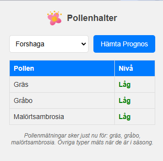

# Pollenprognos för Chrome

Ett enkelt och användarvänligt Chrome-tillägg som visar aktuella pollenprognoser direkt i din webbläsare. Få snabb tillgång till pollendata för olika regioner i Sverige och håll koll på pollennivåerna som påverkar dig.

Detta tillägg använder data från Naturhistoriska riksmuseets pollendatabas via deras officiella API. Naturhistoriska riksmuseet ansvarar för den svenska pollenmätningen och tillhandahåller dagliga pollenprognoser för olika regioner i Sverige.

## Funktioner

- 🌍 Visa pollendata för alla regioner i Sverige
- 🎯 Välj och spara din favoritregion
- 🎨 Tydlig färgkodning av pollennivåer
- 💾 Sparar automatiskt dina inställningar
- 🔄 Uppdatera prognoser med ett klick

## Installation för användare

Följ dessa enkla steg för att installera tillägget i Chrome:

1. **Ladda ner filerna**
   - Klicka på den gröna "Code" knappen ovanför
   - Välj "Download ZIP"
   - Packa upp ZIP-filen till en mapp på din dator

2. **Installera i Chrome**
   - Öppna Chrome
   - Skriv in `chrome://extensions` i adressfältet och tryck Enter
   - Hitta omkopplaren "Utvecklarläge" i övre högra hörnet och slå på den
   - Klicka på knappen "Läs in okomprimerad" som dyker upp
   - Leta upp och välj mappen där du packade upp filerna
   - Klart! Du ska nu se ett blomikon i Chrome's tilläggsfält

3. **Börja använda**
   - Klicka på blomikonen i Chrome för att öppna tillägget
   - Välj din region i rullgardinsmenyn
   - Klicka på "Hämta Prognos" för att se aktuella pollenhalter

## Felsökning

Om du inte ser tillägget efter installation:
1. Kontrollera att utvecklarläge är påslaget
2. Prova att stänga och öppna Chrome igen
3. Se till att alla filer packades upp korrekt

Om data inte laddas:
1. Kontrollera din internetanslutning
2. Klicka på uppdateringsknappen igen
3. Om problemet kvarstår, prova att avinstallera och installera om tillägget

## För utvecklare

För att bidra till projektet:
1. Forka detta repository
2. Skapa en feature branch (`git checkout -b ny-funktion`)
3. Commita dina ändringar (`git commit -am 'Lade till ny funktion'`)
4. Pusha till branchen (`git push origin ny-funktion`)
5. Skapa en Pull Request

## Credits
- **API**: Data provided by [Swedish Museum of Natural History's Pollen API](https://api.pollenrapporten.se/docs).
- **Icons**: Weather icons from [Meteocons Weather Icons](https://iconduck.com/sets/meteocons-weather-icons), licensed under [MIT License](https://opensource.org/licenses/MIT).

## License
This module is licensed under the [MIT License](https://opensource.org/licenses/MIT).

## Support

Om du stöter på problem eller har förslag på förbättringar, vänligen skapa ett ärende under "Issues" på GitHub.